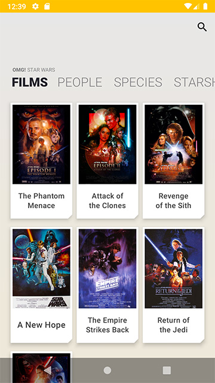
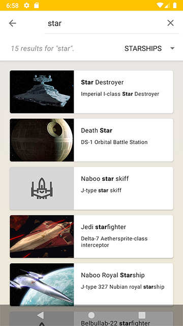
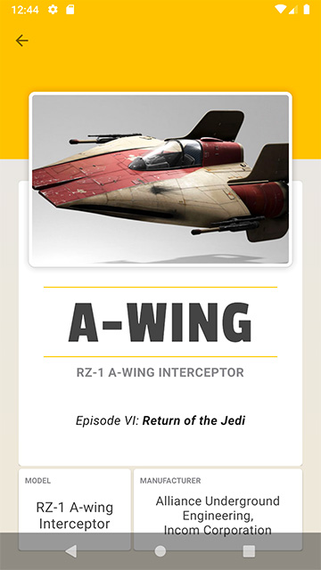

# OMG Star Wars!
Android exercise for loading and displaying content from the Star Wars API:

https://swapi.co/

## Built With

* [Retrofit 2](https://github.com/square/retrofit) - HTTP client
* [RxJava 2](https://github.com/ReactiveX/RxJava) - Reactive extensions
* [Dagger 2](https://github.com/google/dagger) - Dependency management
* [Glide](https://github.com/bumptech/glide) - Image loading and caching
* [Timber](https://github.com/JakeWharton/timber) - Logger
* [Androidx](https://developer.android.com/jetpack/androidx) - Support library
* [opacapp/multiline-collapsingtoolbar](https://github.com/opacapp/multiline-collapsingtoolbar) - multiline toolbar title

## Screenshots (v2)

| Categories | Search |
| --- | --- |
|  |  |

| Detail | Detail (scrolled) |
| --- | --- |
|  | ") |
